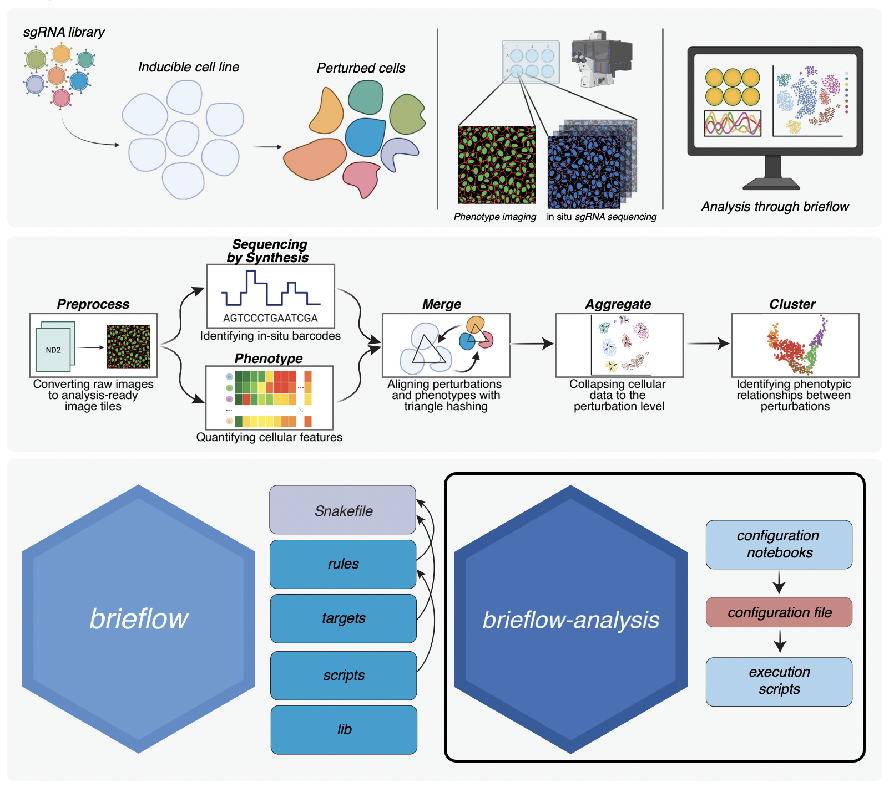

# Brieflow Analysis Template

Brieflow is an extensible computational pipeline for high-throughput analysis of optical pooled screening data.

This repo is a Github template with the configuration notebooks/files and execution scripts for running an OPS screen analysis.
[Brieflow](https://github.com/cheeseman-lab/brieflow) contains the source code for running an OPS screen analysis.

## Example Screen Repositories

| Screen      | Repository                                             | Description                                      | Brieflow Version |
|-------------|--------------------------------------------------------|--------------------------------------------------|------------------|
| Denali      | [cheeseman-lab/denali-analysis](https://github.com/cheeseman-lab/denali-analysis)     | Original screen that drove Brieflow development | 1.0 |
| Aconcagua   | [cheeseman-lab/aconcagua-analysis](https://github.com/cheeseman-lab/aconcagua-analysis) | Re-analysis of Funk et al. 2022                 | 1.0 |

Examples use this template.
More examples coming soon. 
Please contact us if you have used Brieflow in your own analysis!

## Getting Started

We strongly suggest that Brieflow Analysis is set up with the companion [Brieflow](https://github.com/cheeseman-lab/brieflow) repository.

Full details on setup, installation, test data, usage, module details, and contribution guides:  
**https://brieflow.readthedocs.io**

## Contributing

We welcome community contributions to Brieflow!
Feel free to:
- Give [Brieflow](https://github.com/cheeseman-lab/brieflow) a star to boost its visibility!
- Join Brieflow's [Discord](https://discord.gg/yrEh6GP8JJ) to chat with the developers.
- File a [GitHub issue](https://github.com/cheeseman-lab/brieflow/issues) to share comments and issues. We aim to keep brieflow-related issues in the [main Brieflow repository](https://github.com/cheeseman-lab/brieflow/issues).
- Clone the repository, create a new branch, and submit a [pull request](https://github.com/cheeseman-lab/brieflow-analysis/compare).

Make sure to review the Brieflow [development guide](https://brieflow.readthedocs.io/en/latest/4.development.html) to understand how to best contribute!